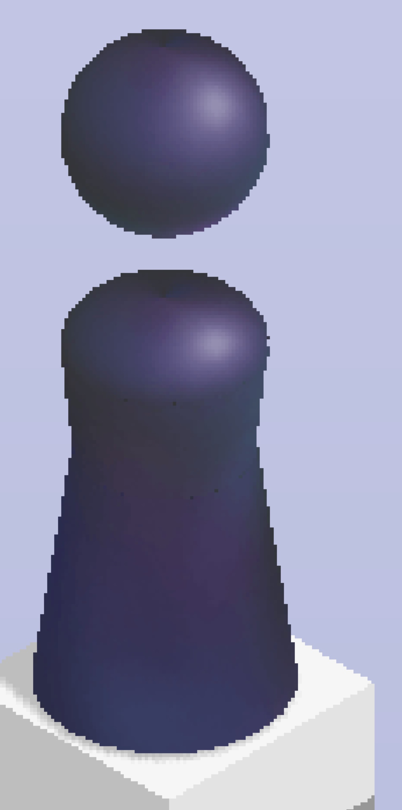

# 距离示例

此文件夹下包含示例图并给出了它们对应的小人与方块中心的坐标，可供大家标注距离时参考

## 取点位置说明

小人的位置是小人底座最下面的一条线（底座是椭圆，边缘是一条线）的中点像素对应的坐标值，目标块的中心位置则是目标块顶面对角线的交点位置（若是椭圆则取长短轴交点）

|              1              |              2              |              3              |
| :-------------------------: | :-------------------------: | :-------------------------: |
|  |  |  |

## 示例图片坐标值

| 序号 | 小人坐标  | 目标块中心坐标 | 距离 |
| :--: | :-------: | :------------: | :--: |
|  0   | 739, 1061 |    415, 895    | 364  |
|  1   | 381, 1096 |    738, 879    | 418  |
|  2   | 796, 1027 |    420, 900    | 397  |
|  3   | 645, 1061 |    427, 901    | 270  |
|  4   | 777, 1122 |    331, 848    | 523  |
